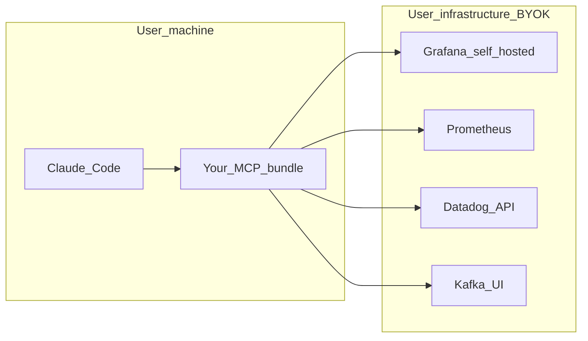

# PRD: Observability MCP — Talk to Datadog, Grafana, Prometheus, and Kafka from your AI assistant

**Document status:** Draft  
**Scope:** Developer tooling only (observability platforms via [Model Context Protocol](https://modelcontextprotocol.io)).  
**Out of scope:** Any unrelated products (e.g. education, visa, or application trackers).

---

## 0. Decisions locked in (stakeholder input)

| Topic | Decision |
|-------|----------|
| **Distribution** | **Public product** — not internal-only. Any developer who already uses Datadog, Grafana, Prometheus, etc. should be able to use it. |
| **Connection model** | **BYOK (bring your own backend):** users supply **base URL(s)** and **credentials** (API token, service account token, or other auth supported per integration). |
| **Grafana** | **Self-hosted** Grafana (not Grafana Cloud as the assumed default). Must meet **Grafana 9+** for full MCP datasource tooling (see §5). |
| **Kafka** | **Kafka UI MCP** is a **first-class** goal (not “metrics-only via Prometheus”). **Reference implementation:** [provectus/kafka-ui](https://github.com/provectus/kafka-ui) (REST API under user’s base URL, typically `/api` — pin/test against specific **image tags** as APIs evolve). |
| **MVP clients** | **Claude Code alone is sufficient for MVP.** Cursor and OpenAI **Codex CLI** are **Phase 1b** — same MCP protocol, expand docs and QA once core works. **Gemini** out of MVP until a chosen surface supports MCP reliably. |

---

## 1. Executive summary

Engineers spend a lot of time **context-switching** between IDEs and observability UIs (Datadog, Grafana, Prometheus, Kafka UI) to answer questions like “Why did CPU spike?”, “What’s on fire?”, “What’s consumer lag?”.

**Product vision:** Any developer installs or runs **your** MCP integration, **points it at their own** Datadog / Grafana / Prometheus / Kafka UI instances using **their URL and tokens**, and uses **Claude Code** (MVP) to ask questions, **run PromQL**, and get **summarized reports** — without opening the web UIs for every routine check.

**Competitive reality:** Official and community MCP servers already cover parts of this (see §5). Your differentiation is a **cohesive product**: one onboarding story, **Kafka UI** coverage, **summarization-oriented** tool design and prompts, optional **unified gateway**, and trustworthy **BYOK security** documentation — not re-implementing PromQL from scratch.

---

## 2. Problem statement

| Pain | Today | Desired |
|------|--------|---------|
| Quick health check | Open Grafana/Datadog, find dashboard, copy PromQL | Ask in the IDE: “Summarize pod CPU in `prod` last hour” |
| Correlation | Jump between logs, metrics, Kafka UI | One conversation with tools that hit each system (within user policy) |
| Kafka ops | Click through Kafka UI for topics / groups / lag | Ask: “Which topics have growing lag?” via MCP |
| Setup friction | Each team wires four different MCPs differently | **One product** with clear steps: URL + token per backend |

---

## 3. Goals

1. **BYOK connectivity:** User configures **their** Datadog, **self-hosted** Grafana, Prometheus, and **Kafka UI** base URL + credentials (and any extra fields per backend, e.g. Datadog site/region).
2. **Natural language + structured queries:** Support questions, **explicit PromQL** (and LogQL where applicable), and **summarized** answers (short narrative + optional tables).
3. **MVP client:** **Claude Code** documented and tested end-to-end; add Cursor and Codex CLI with the same MCP server(s) once stable.
4. **Trust:** Read-only defaults where possible; document what data leaves the user’s machine for the **LLM** provider (Claude) vs what only hits **their** observability APIs.
5. **Clear build scope:** Reuse **vendor/community** MCPs where they fit; **build** a dedicated **Kafka UI MCP** for **provectus/kafka-ui** using its **HTTP API** (see project docs / OpenAPI in-repo; do not scrape the SPA).

### Non-goals (MVP)

- Replacing human on-call judgment or full incident management.
- Scraping web UIs in violation of terms of service (use **documented APIs** only).
- Hosting the user’s Grafana/Datadog/Prometheus (you connect **to** their stack, you don’t run it).
- Gemini support in v1.

---

## 4. Target users and personas

- **Primary:** Individual developers and small teams who run or can reach **self-hosted** Grafana, Prometheus, Kafka UI, and/or use Datadog — and already pay for **Claude** (Claude Code).
- **Secondary:** Platform engineers evaluating a **standard** MCP bundle for a company (they still BYOK; their org owns keys).
- **“Buyer”:** Often the **developer themselves** (PLG); later IT/Security for team deals — your docs must speak to **credential handling** explicitly.

---

## 5. What already exists (can users “just use it” today?)

Yes — **in pieces**. Your product can **compose**, **extend**, or **replace** these layers.

| Platform | Status | What it is | Implication for your product |
|----------|--------|------------|------------------------------|
| **Datadog** | **Official** MCP | Remote MCP; OAuth/API keys; logs, metrics, traces, monitors, etc. | You may **document** first-party setup, or **proxy** through your gateway later. Users BYOK with their Datadog keys. |
| **Grafana** | **Official** [mcp-grafana](https://github.com/grafana/mcp-grafana) | Dashboards, datasources, **PromQL**, **LogQL**; **Grafana 9+**; service account token. | Strong fit for **self-hosted** URL + token. Your value: bundle + docs + Kafka + summaries. |
| **Prometheus** | **Community** MCP | e.g. [pab1it0/prometheus-mcp-server](https://github.com/pab1it0/prometheus-mcp-server) — PromQL, discovery. | Ship as optional connector or reimplement thin tools if you need one binary. |
| **Kafka UI** | **No widely adopted official MCP** | **Target:** [provectus/kafka-ui](https://github.com/provectus/kafka-ui) — exposes a **REST API** consumed by its web UI (paths/versioning depend on server build; treat **kafka-ui version** as part of your compatibility matrix). | **You build** MCP tools: list clusters, topics, consumer groups, lag, offsets, optional read-only message peek — **HTTP client** to `KAFKA_UI_BASE_URL` + auth headers provectus supports. |

**Conclusion**

- **Datadog + Grafana + Prometheus:** Mostly **integration and packaging**, not greenfield science.
- **Kafka UI:** **Core build** for your differentiated story.

---

## 6. What you build (product scope)

### MVP (suggested)

1. **Distribution:** e.g. single **open-source** MCP server (or small set) published with install instructions for **Claude Code** (`mcpServers` config + env vars for URLs/tokens).
2. **Connectors**
   - **Grafana (self-hosted):** Prefer wrapping or forking patterns from **mcp-grafana** with env: `GRAFANA_URL`, `GRAFANA_SERVICE_ACCOUNT_TOKEN` (and TLS options).
   - **Prometheus:** Community MCP or embedded PromQL tools with `PROMETHEUS_URL` + basic auth if needed.
   - **Datadog:** Point users to **official Datadog MCP** in v1 *or* optional unified gateway later — document clearly to avoid duplicating Datadog’s maintenance burden.
   - **Kafka UI (provectus/kafka-ui):** **New MCP** — implement as an HTTP client to the user’s **Kafka UI base URL** (no hosting of Kafka UI by you). MVP tools (illustrative): list clusters, list/describe topics, list consumer groups, lag / partition offsets, broker health; optional “peek messages” **read-only** with **strict** byte/partition limits and **off by default**. Map tool inputs to **provectus** REST routes; document **tested kafka-ui image tag(s)** in README.
3. **Summaries:** Prompt templates + tool responses shaped for **short executive summaries** (you can add a `summarize_last_query` pattern or rely on Claude with structured tool output).
4. **Reports (post-MVP or stretch):** Scheduled digests require a **scheduler + storage**; not required for MCP MVP if “ask when online” is enough.

### Later phases

- **Unified MCP gateway** (one process, one config file, consistent tool prefixes `grafana_*`, `prom_*`, `kafka_*`).
- **Cursor + Codex CLI** parity docs and smoke tests.
- **Team features:** shared encrypted config, SSO — only if you move toward **hosted** product (see §10).

---

## 7. User stories (MVP-oriented)

1. As a user, I want to enter **my Grafana URL + service account token** once (env or config) so Claude Code can query **my** self-hosted instance.
2. As a user, I want to **run PromQL** from chat and see results **consistent** with Grafana’s Explore for the same query and time range.
3. As a user, I want **natural-language** questions like “What are the top CPU pods in namespace X?” answered using my connected backends.
4. As a user, I want **[provectus/kafka-ui](https://github.com/provectus/kafka-ui)** connected via **base URL + auth** so I can ask about **topics, consumer groups, and lag** without opening the browser.
5. As a user, I want **summarized** answers (bullets + key numbers), not only raw JSON.
6. As a user, I want **read-only** behavior by default so I do not accidentally change production from chat.
7. As a user, I want setup docs for **Claude Code** that work on macOS/Linux with copy-paste config.

---

## 8. Clients (MCP)

| Phase | Client | Notes |
|-------|--------|--------|
| **MVP** | **Claude Code** | Primary; all examples and CI smoke tests target this first. |
| **1b** | **Cursor**, **OpenAI Codex CLI** | Same MCP servers; validate transport (stdio vs HTTP) per client docs. |
| **Out of MVP** | **Gemini** | Revisit when a specific Gemini developer surface documents MCP support. |

MCP supports **stdio**, **SSE**, and **streamable HTTP** depending on server; your server choice must match what **Claude Code** expects for local development (often stdio).

---

## 9. High-level architecture



**Credential flow (recommended for MVP trust):** MCP runs **locally**; **URLs and tokens stay in environment variables or OS secret store** on the user’s machine. The **LLM** (Anthropic) sees only what the user/agent sends in conversation — your docs must state this clearly.

**Optional future:** Hosted gateway where users paste tokens — **high** security/compliance bar (encryption, retention, SOC2). Not assumed for MVP.

---

## 10. Security and compliance (BYOK product)

- **Never log full tokens**; redact in error messages.
- **TLS:** Validate certificates for user URLs; document how to use corporate CAs if needed.
- **Least privilege:** Recommend Grafana **Viewer** service account; Kafka UI **read** roles; Datadog **read** keys if applicable.
- **Data residency / LLM:** Observability data flows **user infra → MCP → Claude**. Users must understand that **query results and summaries** may be processed by **Anthropic** per their Claude terms.
- **Kafka messages:** If tools expose message payloads, treat as **high sensitivity** — off by default or strict size/partition limits.
- **Supply chain:** Pin dependencies; publish checksums for release binaries if you ship them.

---

## 11. Success metrics (suggest)

- **Activation:** User completes BYOK config and runs **one successful PromQL query** within **N minutes** of install.
- **Kafka:** **≥80%** of documented MCP tools work against a **reference provectus/kafka-ui** instance (pin **Docker image tag** in CI) in automated or manual test checklist.
- **Retention:** Users return for **on-call-style** questions (weekly active) — measure if you ship telemetry (opt-in).

---

## 12. Phased roadmap

| Phase | Deliverable |
|-------|-------------|
| **P0 — MVP** | Claude Code + **self-hosted Grafana** + **Prometheus** (BYOK); docs; summarization-friendly tool outputs. |
| **P0.5** | **provectus/kafka-ui MCP** (BYOK URL + auth) — topics, groups, lag; read-only; compatibility table for kafka-ui versions. |
| **P1** | **Datadog** path: official MCP doc bundle *or* first-party wiring in your repo; **Cursor + Codex** setup pages. |
| **P2** | Optional **unified** single binary / Docker image; optional **scheduled** reports (separate worker). |

---

## 13. Open questions (remaining)

### Product and GTM

1. **Open source** vs **commercial** (hosted optional)? License (MIT, Apache, AGPL)?
2. Will you ship **one monorepo** MCP or **separate** servers per backend?

### Kafka UI (provectus/kafka-ui)

3. ~~Which Kafka UI distribution?~~ **Locked:** [provectus/kafka-ui](https://github.com/provectus/kafka-ui).
4. Which **auth modes** must MVP support for provectus deployments (e.g. **none** behind VPN, **basic auth**, **OAuth2/OIDC**, **custom headers**)? Provectus images vary by config — document what you test.
5. Minimum **kafka-ui version** (image tag) you commit to for v1 API stability?

### Datadog

6. For MVP, is **“use Datadog’s official MCP + our docs”** acceptable, or must **everything** go through **your** binary?

### Summaries and reports

7. Is “summary in Claude chat” enough, or do you need **PDF/Markdown email** reports in v1?
8. Any requirement for **push** (Slack) in the first release?

### Self-hosted Grafana

9. Minimum Grafana version you commit to (**9.x** vs **10+**)?
10. Do users need **Loki/Tempo** tools in MVP or **metrics-only** first?

---

## 14. Appendix: Example BYOK configuration (illustrative)

**Environment variables (conceptual — names are yours to standardize):**

```bash
# Self-hosted Grafana
export OBS_MCP_GRAFANA_URL="https://grafana.mycompany.internal"
export OBS_MCP_GRAFANA_TOKEN="glsa_..."   # service account token

# Prometheus
export OBS_MCP_PROMETHEUS_URL="https://prometheus.mycompany.internal"

# Provectus Kafka UI (https://github.com/provectus/kafka-ui)
export OBS_MCP_KAFKA_UI_URL="https://kafka-ui.mycompany.internal"
export OBS_MCP_KAFKA_UI_AUTH="..."      # basic auth, bearer, or headers — match what your kafka-ui deployment uses

# Datadog (if using official MCP alongside yours — see Datadog docs)
# export DD_API_KEY=...
# export DD_APP_KEY=...
```

**Claude Code `mcpServers` fragment** — exact JSON depends on whether you ship **stdio** command or **Docker**; follow Claude Code’s current config format when implementing.

**References:** [Grafana MCP](https://github.com/grafana/mcp-grafana), [Datadog MCP](https://docs.datadoghq.com/bits_ai/mcp_server/), [Prometheus MCP example](https://github.com/pab1it0/prometheus-mcp-server), [provectus/kafka-ui](https://github.com/provectus/kafka-ui).

---

## 15. Document history

| Version | Date | Author | Changes |
|---------|------|--------|---------|
| 0.1 | 2026-04-11 | — | Initial PRD; observability-only scope |
| 0.2 | 2026-04-11 | — | Public BYOK product; self-hosted Grafana; Kafka UI first-class; MVP = Claude Code; roadmap + security for BYOK; open questions refreshed |
| 0.3 | 2026-04-11 | — | Kafka UI reference locked to **provectus/kafka-ui**; scope, metrics, open questions, appendix updated |
